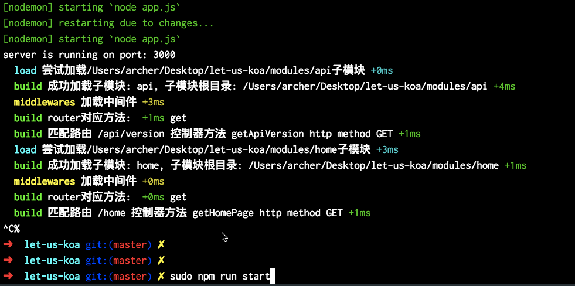

Just another koa-seed-project.

Preview
==========



Why
======

搭建一个koa的脚手架并不困难，但就如其他"体力活"一样，

* 我们并不想重复劳动
* 其他脚手架生成出来的项目目录结构可能并不是我们想要的
* 一些基于Express和Koa类型的框架型项目集成了ORM等重量级组件，当然，这本身无可厚非，大家的定位不一样

What we need
====

我希望只通过一个最小化的"容器"去启动一个应用，它大概只需要以下几个功能就可以了，重要的是，它的目录结构应该是清晰的，可维护的:

核心思想：**模块即同名文件**

* 自动根据模块级目录生成路由
* 模块可插拔
* 支持路由级中间件自动加载
* 脚手架只需要支持router,render,debug就可以了

所以，Let-us-koa的原理非常简单，如果你想快速跑起来一个koa应用，你可以这么做:

Play
======

### Install

```
$ git clone https://github.com/qddegtya/let-us-koa
$ cd let-us-koa
$ npm install
```

### Run!

```
$ npm run start
```

### 新增一个模块

在modules下面新建目录即可，目录名称就是模块加载器自动prefix的一级路由名称，比如我们这里的api和home

分别对应

```
/api
/home
```

**模块必须包含的文件**

```
app.conf.json // 模块配置文件
controllers.js // 控制器
```

### app.conf.json

```
{
  "routes": [
    // 路由规则
    // [HTTP方法]#[/your route]#[controller]
    "GET#/version#getApiVersion"
  ],
  "active": true // 模块是否激活
}
```

### 模块下的controllers

```
'use strict'

// 只需要导出对应的方法即可
module.exports = {
  getApiVersion: function* () {
    this.body = {
      'version': 'v1'
    }
  }
}
```

### 全局配置

```
{
  // 子模块目录
  "modules": "modules",

  // 上传目录
  "upLoadDir": "public/uploads",

  // 自定义中间件存放目录
  "middlewareDir": "middlewares",

  // 子模块渲染服务的view path
  "subModuleViewPathName": "views",

  // 全局渲染选项
  "renderSettings": {
    "autoescape": true,
    "cache": "memory",
    "ext": "html"
  }
}

```


### 中间件

**应用级中间件**

推荐把加载逻辑写进middleware.js里

**路由级中间件**

let-us-koa自动为你处理了这块中间件的加载逻辑

你可以参考下面的配置:

```
{
  "routes": [
    "time|log|GET#/version#getApiVersion"
  ],
  "active": true
}
```

它表示，该路由将经过time,log中间件，对应的源文件就是middlewares下的同名文件，当然，你可以在全局的app.conf.g.json中更改这个配置

### 关于渲染方法的挂载

如果你的某个子模块需要挂载渲染方法，那你必须显式地在子模块app.conf.json中声明needRender选项

```
{
  "routes": [
    "GET#/#getHomePage"
  ],
  "active": true,
  "needRender": true
}
```

这样，let-us-koa就会自动为你挂载这个render方法。

idea: 比如一些API服务模块，可能不需要渲染服务，那就没有必要构建render

### 静态资源托管

默认托管在种子项目根目录下的public

用途
=======

一个"尽量最小化"的基于koa的web server容器，其实就可以跑起来一些小应用，这些应用也许不需要持久化存储等复杂功能的支持，比如它只需要一个简单的渲染服务？

瞧，我们可以利用它快速搭建一个内部的研发平台导航站点，It's Cool.


同时，希望给学习koa的初学者提供一个这样的脚手架，让你可以快速入门。

So, Let us Koa!
